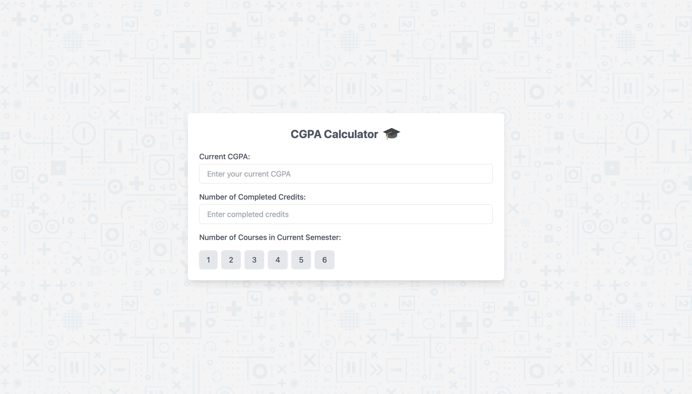
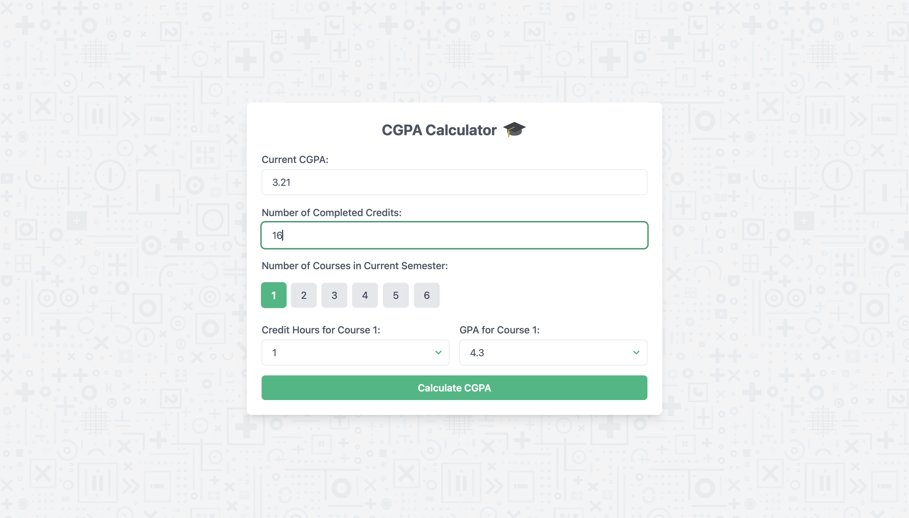
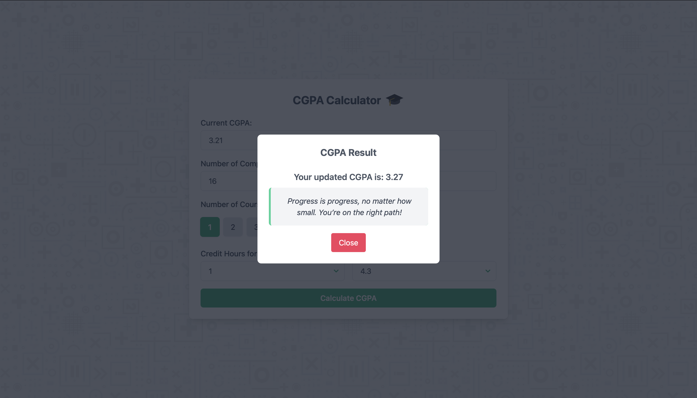

# 🎓 CGPA Calculator

The **CGPA Calculator** is a sleek and user-friendly web application that helps students calculate their updated CGPA. With dynamic course input fields, real-time validation, and tailored motivational quotes, this app makes academic progress tracking both functional and inspiring.

---

## 🌟 Screenshots

### Home Screen


### Course Selection


### Result Modal


---

## ✨ Features

- **Dynamic Inputs**: 
  - Add courses dynamically (1–6 courses per semester).
  - Dropdowns for **Credit Hours** and **GPA** per course.

- **Real-Time Validation**: 
  - Ensures accurate inputs for **CGPA** (0.0–4.3) and **Credits**.

- **Smooth Transitions**:
  - Animated UI elements for a seamless experience.

- **Motivational Quotes**:
  - Custom quotes based on your CGPA to keep you inspired.

- **Responsive Design**:
  - Optimized for all screen sizes, including desktops, laptops, and tablets.

---

## 🛠️ Tech Stack

- **HTML**: Markup for the app structure.
- **CSS (TailwindCSS)**: Modern, utility-first framework for responsive styling.
- **JavaScript**: Core logic for dynamic field generation, validation, and CGPA calculation.

---

## 🚀 Getting Started

Follow these steps to set up and run the CGPA Calculator locally.

### Prerequisites

- A modern web browser (e.g., Chrome, Firefox, or Edge).
- Optionally, a local development server to serve the app.

### Installation

1. Clone the repository:
   ```bash
   git clone https://github.com/Iktisad/cgpa_calculator.git
   cd cgpa-calculator
   ```
2. Ensure all required assets are in place:
   - **JavaScript Files**: `script.js`, `quotes.js`.
   - **Images/SVGs**: Add to `public/assets/`.

3. Open `index.html` in your browser:
   - Double-click the file, or
   - Serve it using a local development server:
     ```bash
     npx http-server .
     ```

---

## 📖 Usage

1. **Input your details**:
   - Current CGPA (0.0–4.3).
   - Number of completed credits.
2. **Select courses**:
   - Choose the number of courses (1–6) for the current semester.
3. **Enter grades**:
   - Fill out the dynamically generated dropdowns for credit hours and GPA.
4. **Calculate**:
   - Click the **Calculate CGPA** button.
5. **View Results**:
   - The modal displays your updated CGPA and a motivational quote.

---

## 📂 Folder Structure

```
cgpa_calculator                             
├─ public                                   
│  └─ assets                                
│     ├─ icons                              
│     │  └─ rotate.gif                      
│     ├─ imgs                               
│     │  └─ Designer.jpeg                   
│     ├─ js                                 
│     │  ├─ quotes.js                       
│     │  └─ script.js                       
│     └─ svgs                               
│        ├─ calculate-svgrepo-com.svg       
│        └─ graduation-cap-svgrepo-com.svg  
├─ screenshots                              
│  ├─ home.png                              
│  ├─ modal.png                             
│  └─ selection.png                         
├─ LICENSE                                  
├─ README.md                                
└─ index.html                               

```

---

## ⚙️ Customization

### Motivational Quotes
Update the motivational quotes in `quotes.js`:
```javascript
export const motivationalQuotes = {
    "4.0-4.3": ["Excellence is your habit!"],
    "3.5-3.9": ["Almost there, keep pushing!"],
    ...
};
```

### Validation Ranges
Adjust CGPA or credit ranges in `script.js`:
```javascript
restrictToNumbers(currentCGPAInput, 0.0, 4.3); // CGPA range
restrictToNumbers(completedCreditsInput, 0, 160); // Credit range
```

### TailwindCSS Styling
Customize the styling directly in `index.html` or `script.js` by modifying Tailwind classes.

---

## 🎯 To-Do List

- [ ] Add **dark mode** support.
- [ ] Expand the pool of motivational quotes.
- [ ] Add multi-language support for quotes.

---

## 🤝 Contributing

We welcome contributions! Here's how you can help:
1. Fork the repository.
2. Create a feature branch: `git checkout -b feature-name`.
3. Commit your changes: `git commit -m "Add feature-name"`.
4. Push to the branch: `git push origin feature-name`.
5. Open a Pull Request.

---

## 📜 License

This project is licensed under the **MIT License**. Feel free to use, modify, and distribute it!

---

### 💬 Have Feedback or Questions?

I’d love to hear from you! Open an issue or connect with us via GitHub.

---
